 

*** 
## Github Stats

    
      
    
    

 

## 🧰 Toolbox
<table><tr><td valign="top" width="33%">
    
### 🎨 Frontend 

  
  
  
  
  
  
  

</td><td valign="top" width="33%">

### ☁️ Backend + Cloud 

  
  
   
   
  
  
  
  
  
  

</td><td valign="top" width="33%">

### 🤖 Miscellaneous

  
  
  
  
  
  
  
  
  
  

</td></tr></table>

   

## My Skill Set  
<table><tr><td valign="top" width="33%">

### Frontend  

  
  
  
  
  
  
  

</td><td valign="top" width="33%">

### Backend  

  
  
  
  
  
  
  
  

</td><td valign="top" width="33%">

### DevOps  

  
  
  
  
  
  
  
  
  
  
  
  
  

</td></tr></table>  

   
